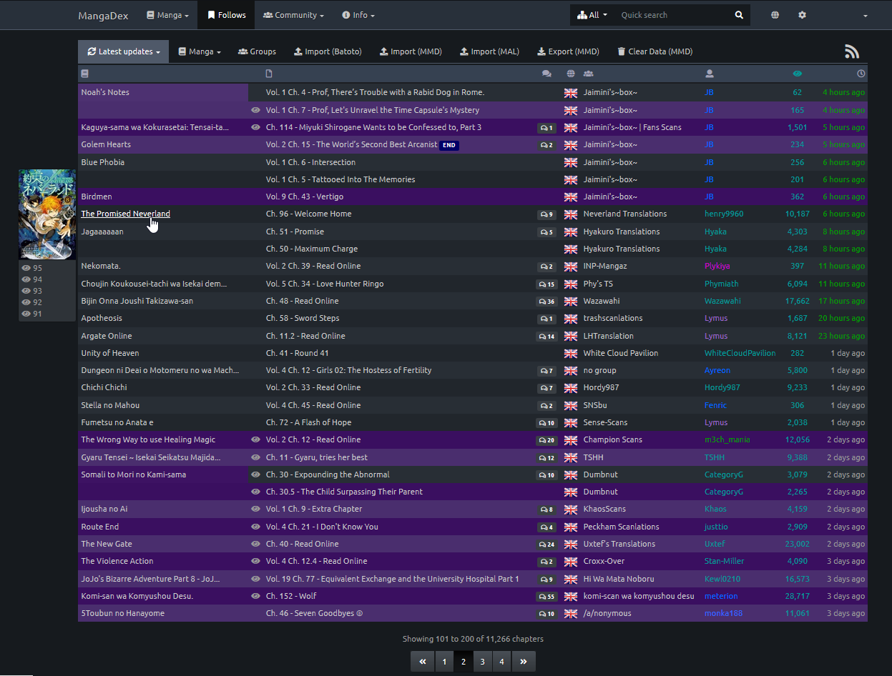

# MyMangaDex

  
Extension inspired from [KissAnimeList](https://github.com/lolamtisch/KissAnimeList) that synchronize what you read on MangaDex.org to your MyAnimeList.net manga list.

* Why?

Updating your manga one by one, by hand, when you have hundreds of them and read a lot of them each day is a long, tiring task...

* Why no KissAnimeList fork?

I find the current script too "full". It's complicated, and there is a lot of useless features (for myself).  
It was easier to just build a new script from scratch with only what was needed.  
Also, MangaDex offer MyAnimeList links on each manga page (Thanks to the community), unlike KissManga, so there is no need for an additionnal database to check.  
Update: KissAnimeList added a support for MyMangaDex if you wish to stick with it.

* What you need buddy

I only store the least possible data:  
An entry for each MangaDex manga that hold the last open chapter, the MyAnimeList id and the list of all opened chapters for each manga (can be disabled)

## How to Install

You can install it from the [Firefox add-ons site](https://addons.mozilla.org/fr/firefox/addon/mymangadex/).

If you want to have some kind of experimentale experience, you can install it directly from this repo:

1. Be sure that the version from the Firefox add-ons site is not installed (don't know what it would do, maybe just won't work)
2. Clone the repo
3. Go to [about:debugging](about:debugging)
4. Click "Load a temporary module"
5. Select any file of the cloned repo.
6. Done !

Works best with the MangaDex dark theme !

## How to use

Once you have it installed, you have nothing to do!  
Start reading manga and the add-on will track them automatically.  
But if you have a lot of manga, or if you're coming from another site and want to set your follow page up-to-date, you can use the "Import (MAL)" button on the follow page that will update the last open of all followed manga if they have a MyAnimeList entry.

## Features

MyMangaDex improve 3 pages and a type of pages:

### Follow page

Any page with a chapters list have the following improvments:

* Display the thumbnail of the manga when hovering
* Highlight last read chapters
* Remove old chapters from the list.

You can also import your data from MyAnimeList here (The last read of every manga you follow on MangaDex)

### Manga page

* Show some information about the manga entry on MyAnimeList if it exists
* Highlight your last read chapter and all opened chapters if you want
* Start reading the manga or add it to your Plan to Read list
* Add a MyAnimeList id if there isn't one

### Chapter page

* Automatically update the MyAnimeList manga entry to the current chapter number if it's the highest
* If it's the first chapter, the start date is set to today and the status is set to "Reading"
* If it's the last chapter, the finish date is set to today and the status is set to "Completed"

### "List" pages

The search pages, featured, titles, and manga published by groups or users, the page with a list of titles is improved:

* A thumbnail of the manga is shown when hovering the row of a title on simple view, when one isn't shown by default

## Useful links

[Import favorites from KissManga to MangaDex](https://old.reddit.com/r/manga/comments/8qebu4/import_kissmanga_bookmarks_to_mangadex/)

## Change log

### 1.6.1

* Fix for the MangaDex update (/manga is now /title)

### 1.6

* Rereading
  * Can edit the "is_rereading" value in the edit modal
  * Added a "Re-read" button on the manga page when a manga is completed
* Avoid updating if the chapter is delayed

### 1.5.6 (+ 1.5.7)

* Fix not updating the last read

### 1.5.4 (+ 1.5.5)

* Update to support chapter change with the new reader
* Fix for Import (MAL)
* Fixed the modal header height

### 1.5.3

* Fixed the Addon .. Again !
  * This time it was MangaDex that updated
* Removed the "Follow Button" on lists page, and the corresponding option
  * MangaDex added them
* Minified vanilla-notify and mymangadex
* Moved the notification to the left, since the reader menu is now on the right
* Added the the MDList page to the list of pages containing lists of titles

### 1.5.2

* Fixed the Addon
  * Recent MyAnimeList broke it somehow :(
* Tooltips now appear faster and don't wait for the thumbnail to load fully

### 1.5

* Bug fixed
  * An empty chapter page (for when a group WILL publish a chapter, but isn't due to group delay) wasn't working
* Updating a MyAnimeList entry trough the Edit button now edit informations if they are displayed (Manga page)
* Added the /group and /user page to highlight chapters like in the /follows page
* Added the /group and /user page to the list of pages that contains a list of titles (to display the Follow/Read buttons)

### 1.4

* Modal to directly edit all informations from MyAnimeList
* Tooltip with thumbnail on pages with a list and without thumbnail
* "Reading" and "Plan to read" button on the pages with a list
* Detect if a MyAnimeList was added on MangaDex
* Bigger notifications
* Modified the thumbnail URL to avoid s1.

### 1.3

* Bugs fixed again
* Better main loop on the follow page
* Removed support for 1.1 (1.2 and higher are fine)
* Save only a certain amount of chapters * Default 100, option to change it
* Better updates handling

### 1.2

* Lot of bugs fixed
* Cleaner code (I hope)
* Keep track of any opened chapters and highlight them
* Show manga image and last 5 highest opened chapters when hovering the title

### 1.1 (1.0)

* Keep track of last open chapter for each manga
* Update manga info on MyAnimeList
* Import data from MyAnimeList
* Better follow page
* Display some informations and highlight last open on the manga page
* Export, import and delete MyMangaDex local storage
* Add a MyAnimeList link if there isn't one for a manga
* Some options

## TODO

* Auto add to Reading and Completed lists on MangaDex