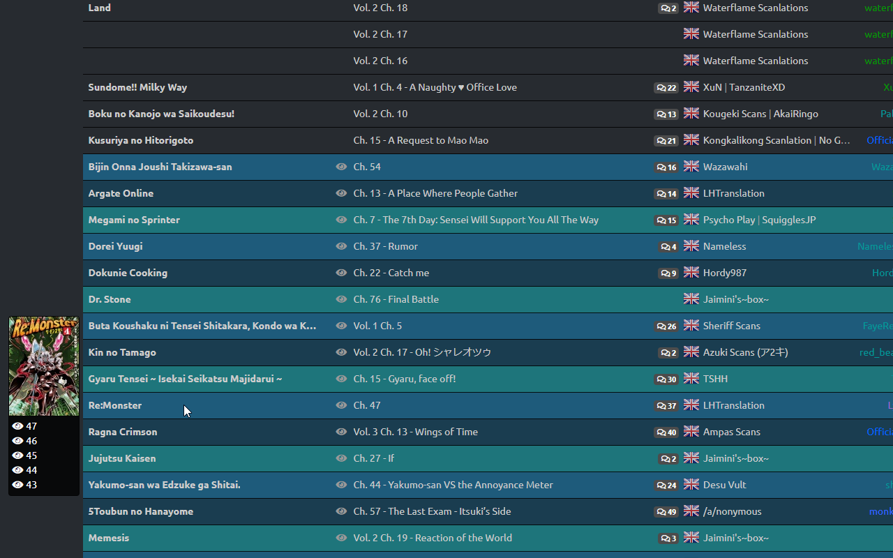

# MyMangaDex

  
Firefox and Chrome extension that synchronizes what you read on MangaDex.org to your MyAnimeList.net manga list.

## Why

Updating your manga one by one, by hand, when you have hundreds of them and read a lot of them each day is a long, tiring task...

## How to Install

You can install it from the [Google Chrome Web Store](https://chrome.google.com/webstore/detail/mymangadex/ihejddjcdmdppiimegmknbcaiebklajl) or the [Firefox add-ons site](https://addons.mozilla.org/en/firefox/addon/mymangadex/) (Also *working* on Firefox for Android).  

## Requirements

You have to be logged on MyAnimeList or your list won't be updated, since the extension loads pages and sends requests like **you** would do, no credentials are stored in the extension.  
You don't have to be logged in on MangaDex but you can't access your followed manga without an account.

## How to use

Once the extension is installed, you have nothing to do!
Start reading manga and the extension will update them automatically.

If you have a lot of manga, or if you're coming from another site and want to set your follow page up-to-date, you can use the **Import (MAL)** in the options that will update the last opened of all followed manga on MangaDex if they have a MyAnimeList entry.  
The import *could* be long if you have a lot of manga in your list, don't leave the page until it ends.

## Features

MyMangaDex also improves some pages and adds useful features:

### Chapters list page

Tooltips with a thumbnail of the manga and a list of the last 5 opened chapters are added to each title in the list.  
Old chapter are also hidden, or highlighted, and your last opened chapters are highlighted. You can change the paint color for both of these.

### Manga page

Some useful information about your status on MyAnimeList is displayed, a modal is added to easily update all informations of the entry.  
A set of buttons is also added, those buttons are shortcuts to common actions, Starting a manga, adding it to your Plan to Read list or Re-reading it.  
All chapters you opened and the last read chapter are also highlighted in the chapter list. You can change the colors in the options.

### Chapter page

Apart from the automatic MyAnimeList update, the same modal as on the Manga page is added, to easily update all information of an entry.  
The extension can also automatically update your MangaDexList when required, for example when you start reading a manga or when you complete it... This option is disabled by default, you need to enable it in the options.

### History page

MyMangaDex can remember more than your last 10 read chapters and display all of them.

### MAL Import

The import from MAL feature sets the last read chapter of every manga you follow on MangaDex using your MyAnimeList data.

### MAL Export

The export to MAL feature adds or updates on MyAnimeList all the titles in your MangaDex follow list.

> This is good if you wish to **start** using MyAnimeList with a full MangaDex follow list ;)

## Online Save

You can enable the option to upload your save to an online service, using a [MMD - Online Save](https://github.com/Glagan/MyMangaDex-OnlineSave) website.  
By default, this option is turned off and the default website available is my site, [https://mmd.nikurasu.org](https://mmd.nikurasu.org/), but you can clone the Online Save repo and host it yourself, then you just have to change the URL in the options.  

> Hosting an online service won't actually work for Firefox because of certain limitations...

When you enable that option, you need to set your username and your password, and that's the only thing you need to remember.  
When you change computer, after reinstalling the extension, you just have to enter them again and your save will be imported locally, and your future updates will be saved online.  
All of the data is still saved locally and the extension only use local data.

## Data stored

I only store the least possible data:

* The last open chapter for each manga
* The MyAnimeList id for each manga
* A list of all opened chapters for each manga
* The list of options used to customize colors and other parameters
* If you have the ``Update History page`` option enabled, the name, chapter ID, MangaDex ID and the volume/chapter are saved.

You can disable the option to save all opened chapters, and all of the data can be easily exported using the **Export (MMD)** in the options.

> Your password is not stored if you use the Online Save feature

## Debug installation

You can also install the extension from this repository, but the extension **will** be uninstalled when Firefox is closed and the data **could** be deleted at the same time, Chrome will keep the extension installed.  
Before you can actually build it, make sure you have [node](https://nodejs.org) and [npm](https://www.npmjs.com) installed. Make sure both are in your path ([On Windows](https://stackoverflow.com/a/27864253)). In the cloned directory then run ``npm install``. This will install all dependencies.

To build the extension, run ``npm run firefox`` or ``npm run chrome``. Both commands support options, separated by ``--``:

Options:

* ``-no-minify``: Don't use **terser** to minify scripts.
* ``-debug``: Add a global try catch block.

Example: ``npm run chrome -- -no-minify -debug``

### Firefox

1. Be sure that the version from the Firefox add-ons site is not installed (don't know what it would do, maybe it just won't work)
2. Clone the repo and move your terminal to the new folder
3. Install dependencies ``npm install``
4. Build ``npm run firefox``
5. Go to [about:debugging](about:debugging)
6. Go to *This Firefox*
7. Click *Load a Temporary Add-on...*
8. Select *manifest.json* of *firefoxBuild* folder
9. Done !

### Chrome

1. Make sure it isn't already installed
2. Clone the repo and move your terminal to the new folder
3. Install dependencies ``npm install``
4. Build ``npm run chrome``
5. Go to [chrome://extensions/](chrome://extensions/)
6. Activate *Developper Mode* on the top right
7. Click *Load Unpacked*
8. Select the *chromeBuild* folder
9. Done !

### Developing

MyMangaDex now comes with a developing script.
Make sure you have the repo and all dependencies installed (see above).
Run ``npm run firefox:dev`` / ``npm run chrome:dev`` to watch and automatically rebuild and reload the extension.

`chrome:dev` uses the chromium target with less support.
`firefox:dev` has full support and accepts the following additional arguments:
- `-profile name` Use existing profile. *This profile should **not** be used for daily use anymore (See [here](https://extensionworkshop.com/documentation/develop/web-ext-command-reference/#web-ext_run))*
- `-mobile [device]` Connect to FireFox Android over `adb`. If not device is supplied, lists available devices.
Example: ``npm run firefox:dev -- -mobile 73QPH18801900227``

## Useful links

* Extension inspired by [MAL-Sync](https://github.com/lolamtisch/MALSync).
* [Import favorites from KissManga to MangaDex](https://old.reddit.com/r/manga/comments/8qebu4/import_kissmanga_bookmarks_to_mangadex/)
