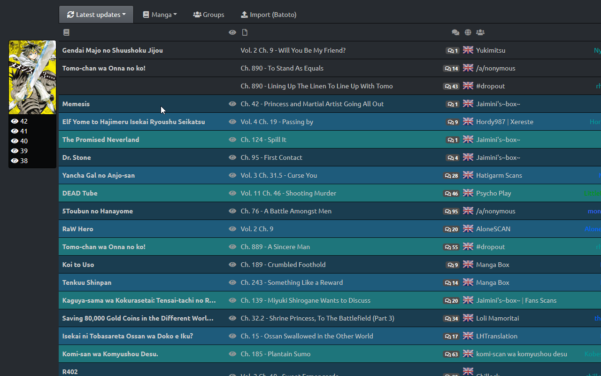

# MyMangaDex

  
Firefox and Chrome extension that synchronize what you read on MangaDex.org to your MyAnimeList.net manga list.

## Why

Updating your manga one by one, by hand, when you have hundreds of them and read a lot of them each day is a long, tiring task...

## How to Install

You can install it from the [Google Chrome Web Store](https://chrome.google.com/webstore/detail/mymangadex/ihejddjcdmdppiimegmknbcaiebklajl) or the [Firefox add-ons site](https://addons.mozilla.org/fr/firefox/addon/mymangadex/).  

## Requirements

You have to be logged on MyAnimeList or your list won't be updated, since the extension load pages and send requests like **you** would do, no credentials are stored in the extension.  
You don't have to be logged on MangaDex but you can't access your followed manga without an account.

## How to use

Once the extension is installed, you have nothing to do!  
Start reading manga and the extension will update them automatically.

If you have a lot of manga, or if you're coming from another site and want to set your follow page up-to-date, you can use the **Import (MAL)** in the options that will update the last open of all followed manga on MangaDex if they have a MyAnimeList entry.  
The import *could* be long if you have a lot of manga in your list, don't leave the page until it ends.

## Features

MyMangaDex also improve some pages:

### Chapters list page

Tooltips with a thumbnail of the manga and a list of the last 5 opened chapters are added to each title in the list.  
Old chapter are also hidden, or highlighted, and your last opened chapters are highlighted. You can change the paint color for both of these.

### Manga page

Some useful informations about your status on MyAnimeList are displayed, a modal is added to easily update all informations of the entry.  
A set of buttons is also added, those buttons are shortcut to common actions, Starting a manga, adding it to your Plan to Read list or Re-reading it.  
All chapters you opened and the last read chapter are also highlighted in the chapter list. You can change the color in the option.

> The modal isn't available on Chrome for now.

### Chapter page

Apart from the automatic MyAnimeList update, the same modal of the Manga page is added, to easily update all informations of an entry.  
The extension can also automatically update your MangaDexList when required, for example when you start reading a manga or when you complete it... This option is disabled by default, you need to enable it in the options.

### MAL Import

The import from MAL feature set the last read chapter of every manga you follow on MangaDex using your MyAnimeList data.

## Data stored

I only store the least possible data:

* The last open chapter for each manga
* The MyAnimeList id for each manga
* A list of all opened chapters for each manga
* The list of options used to customize colors and other parameters

You can disable the option to save all opened chapters, and all of the data can be easily exported using the **Export (MMD)** in the options.

## Debug installation

You can also install the extension from this repository, but the extension **will** be uninstalled when Firefox is closed and the data **could** be deleted at the same time, Chrome will keep the extension installed.  
Before you actually install it, you have to manually edit the ``manifest.json`` file to remove what you don't use, either the Firefox or Chrome lines.

### Firefox

1. Be sure that the version from the Firefox add-ons site is not installed (don't know what it would do, maybe it just won't work)
2. Clone the repo
3. Go to [about:debugging](about:debugging)
4. Click *Load a temporary module*
5. Select any file of the cloned repo.
6. Done !

### Chrome

1. Make sure it isn't already installed
2. Clone the repo
3. Go to [chrome://extensions/](chrome://extensions/)
4. Activate *Developper Mode* on the top right
5. Click *Load Unpacked*
6. Select the **MyMangaDex** folder
7. Done !

## Useful links

* Extension inspired from [KissAnimeList](https://github.com/lolamtisch/KissAnimeList).
* [Import favorites from KissManga to MangaDex](https://old.reddit.com/r/manga/comments/8qebu4/import_kissmanga_bookmarks_to_mangadex/)